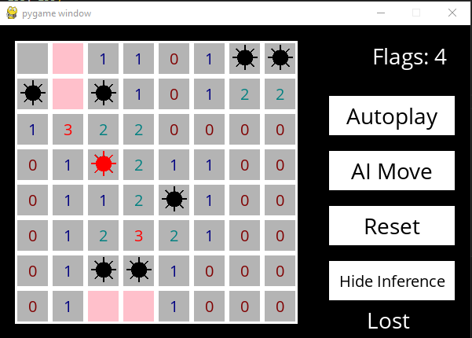

# MINESWEEPER-AI
## Description
- *Minesweeper* game integrated with an AI assistant to help you avoid mines.
- The AI uses Propositional Logic and Inference Rules to deduce safe and dangerous cells.
- Features include AI making moves or autoplaying the game.
## Features
- *AI Move* : Let the AI make the best move for you, though it may occasionally select a mine.
- *Autoplay* : Watch the AI play the game autonomously, starting with random moves and progressing to safe ones as more knowledge is gathered.
- *Show Inference* : Visualize the AI's deductions, with cells marked as safe (PINK) or mines (RED).
## Game Output
  

Start Screen

    

Game Start

    

Gameplay with Inference shown

    

When you land up on a mine - Game lost

    

When all the mines are flagged - Game won

    

